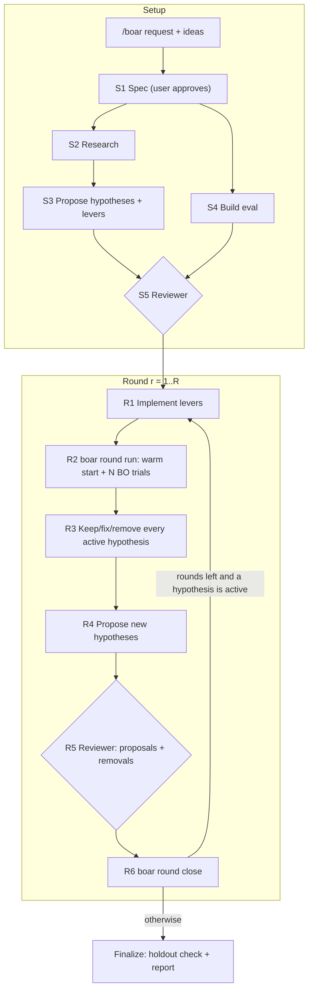

# BOAR: Bayesian Optimization AutoResearch

Design for v1. Build from this document.

You start it with `/boar <request>`. The request names a measurable improvement task (faster code, lower RAM, more stable training, higher throughput, and so on) and includes the user's ideas, often in a markdown file. BOAR then runs a research loop without supervision. It researches the problem and turns what it finds into **hypotheses**, each with **levers**. It runs Bayesian optimization over those levers against a fast, representative **eval**. Between **rounds** it drops weak hypotheses and adds new ones under independent review, and each round's optimization starts from what earlier rounds learned. After R rounds it writes a report of what worked, what didn't, and a log of every experiment.

## Glossary

Each term has exactly this meaning everywhere in this document.

| Term | Meaning |
|---|---|
| **Spec** | `spec.md`: the user's intent written out explicitly: metric, target population, guards, scope, known cheats. The user approves it, and every review checks against it. |
| **Hypothesis** | One claim that can be tested: "mechanism X moves the metric." It has one or more levers. Status goes `pending` → `active` or `rejected`, then `active` → `removed`. |
| **Lever** | A tunable parameter that turns on, or scales, a hypothesis's mechanism in the target code. Its type is `bool`, `int`, `float` or `categorical`. Its `default` reproduces the baseline behaviour. |
| **Search space** | The levers of all `active` hypotheses. Levers belonging to any other hypothesis stay *pinned* at their default. |
| **Eval** | The executable that turns a lever config into a metric value. It must be fast and representative, and it is *frozen* (can't change) once reviewed. |
| **Guard** | A condition the eval checks on every run and that must hold: outputs are correct, accuracy stays at or above a floor, RAM stays under a ceiling. A trial that fails a guard is *infeasible*. |
| **Dev / holdout** | Two separate sets of workloads, both drawn from the spec's target population. BO only ever sees dev. Holdout is used once, at finalize. |
| **Trial** | One lever config, evaluated `repeats` times on dev. Its metric is the median of those runs. |
| **Round** | Implement the levers, run N trials, decide on each hypothesis, propose new ones, review, close the round. |
| **Warm-start set** | The earlier trials that are still valid in the current search space (rules under [BO and warm start](#bo-and-warm-start)). Each round's optimization starts from it. |
| **Baseline** | The config with every lever at its default. |
| **Incumbent** | The best feasible config in the warm-start set. Trials that share a config have their repeats pooled before ranking. |
| **Noise floor** | How much the baseline trial's repeats spread. Any effect smaller than this counts as no effect. |
| **Cheat** | A change that moves the metric on the eval but doesn't move it on the target population. |
| **Reviewer** | A separate subagent that starts with fresh context. It judges proposals, removals and the eval against the spec. |
| **Harness** | The `boar` CLI. It owns the run state, runs the trials, and refuses any step taken out of order. |

## Control principle

The agent makes every judgment call, and the harness makes sure each call actually gets made. Every state change is a `boar` command, and each command refuses to run until its preconditions hold. A Stop hook keeps the agent working until the run is finalized. The agent finds out what it has to do next from `boar next`, not from its own memory.

| Actor | Owns |
|---|---|
| Main agent | Drafting the spec, research, hypotheses and their levers, the eval, implementing levers, analysis, synthesis, the report narrative |
| Reviewer subagent | An accept or reject verdict on each proposal, each removal and the eval |
| Harness (`boar`) | Run state, budgets, BO and warm start, running trials, logging, round summaries, report tables, refusals |
| Stop hook | Blocks the agent from stopping while `boar next` reports work still to do |

## Flow



## Phases

Each phase ends with a **done when** line, the condition that marks it complete. The harness checks every condition marked ⚙.

### Setup

**S1 Spec.** Draft `spec.md` from the request and the ideas file. It has these sections:

- **Goal**: one sentence, in the user's words.
- **Metric**: its name, unit, direction (min or max), and how it is measured.
- **Target population**: the real workloads or conditions that an improvement has to carry over to.
- **Guards**: the conditions every trial has to satisfy.
- **Scope**: which changes are allowed and which are not.
- **Known cheats**: ways someone could game this particular metric.
- **User ideas**: the user's list, copied word for word.
- **Budget**: any changes to the defaults in [Config](#config).

Done when: the user approves the spec. This is the only point where a human has to sign off. `boar init --spec spec.md` comes next, and from then on the run continues without supervision.

**S2 Research.** Collect candidate mechanisms from two places. The first is the target system itself: profile it, read its code and logs. The second is outside sources: docs, papers, issue trackers, the web. Write them to `research.md`. Done when: every user idea shows up either as a candidate or as a rejection with a reason, and every external candidate has a citation.

**S3 Initial hypotheses.** Turn the candidates into hypotheses (see [schema](#schemas)) and submit them with `boar propose`. Give each hypothesis one mechanism, and give each lever a default that reproduces the baseline. Done when ⚙: at least one proposal is pending.

**S4 Eval.** Build the eval in `.boar/<run>/eval/` following the [eval contract](#eval-contract). Draw the dev and holdout workloads from the target population. Pick typical instances: a case where a gain wouldn't carry over to the rest of the population is the wrong case. Done when ⚙ `boar eval check` passes, which means:

- the output follows the contract;
- the guards pass at baseline;
- one baseline trial, counting all its repeats, takes no more than 2 × `trial_target_s`.

`trial_target_s` is a design target, not a limit. Build the smallest eval that is still representative, and aim for about the target: a trial at 11 minutes against a 10-minute target is fine. Some workloads have no natural size, training for example. For those, the eval can run the workload for a fixed wall-clock time and then measure the result. That also keeps trials comparable, which is the approach [karpathy/autoresearch](https://github.com/karpathy/autoresearch) takes.

**S5 Review.** Send the reviewer every pending proposal and the eval. Done when ⚙: every item has a verdict, the eval is accepted, and at least one hypothesis is accepted. If the eval is rejected, go back to S4. If no hypothesis is accepted, go back to S3. After 3 failed attempts at either one, stop and ask the user.

### Round r (1…R)

**R1 Implement.** In the target code, implement the mechanism of every newly `active` hypothesis, and repair every hypothesis the previous round marked `fix`. Each lever reads its value from the config that the eval passes through. All changes go on branch `boar/<run-id>`, so the user's own branch stays untouched. Done when: every active lever changes behaviour when it is set away from its default. Any lever that crashes shows up in R2.

**R2 Run** ⚙ `boar round run`. The harness:

1. Refuses to run if the eval's hash has changed or any verdicts are still pending.
2. Commits the working tree to `boar/<run-id>` and records the commit.
3. Builds the round's study over the current search space and copies the warm-start set into it.
4. Queues the incumbent as the round's first trial, so it is measured again on the current commit. In round 1, or when the warm-start set has no feasible trial, the baseline takes its place.
5. Runs trials until N new ones have finished.
6. Writes `rounds/<r>/summary.md`, which contains:
   - the incumbent, and a drift flag if its new measurement differs from earlier ones by more than the noise floor;
   - the noise floor;
   - the warm start: how many earlier trials were copied in, and how many were left out under each rule;
   - each lever's marginal effect over the warm-start set plus the new trials: the median metric for each value of a bool or categorical lever, the rank correlation for a numeric lever;
   - the infeasible and failed trials, with links to their logs.

A round takes about an hour with the defaults, longer than the shell tool's timeout. Run it in the background and wait for it to finish.

**R3 Analyse.** For every active hypothesis, run `boar decide <id> keep|fix|remove --reason … --trials <ids>`.

- `keep`: the hypothesis helps, or there isn't enough evidence yet.
- `fix`: a lever crashed or misbehaved because of a bug in its implementation. The hypothesis stays active, R1 repairs it, and earlier trials that set its levers away from default drop out of the warm-start set.
- `remove`: the trials that varied its levers show no effect beyond the noise floor, or show consistent harm. A removal only takes effect once the reviewer accepts it in R5.

Done when ⚙: every active hypothesis has a decision for this round.

**R4 Synthesize.** Propose new hypotheses based on the results and the spec, plus targeted research if it helps (`boar propose`). To retune a lever, propose a new hypothesis with `supersedes: <id>`. For example, widen a range when the incumbent sits at its edge. Done when ⚙: there is at least one proposal, or `boar propose --none --reason …` was run.

**R5 Review.** The reviewer judges every new proposal and every removal from R3. Done when ⚙: every proposal and every removal has a verdict.

**R6 Close** ⚙ `boar round close`. Applies the accepted removals. A hypothesis whose removal was rejected stays active. Activates the accepted proposals, removing any hypothesis they supersede. Refuses if more hypotheses are active than `max_active` allows. If rounds remain and at least one hypothesis is active, the next round starts at R1. Otherwise the run moves to finalize.

### Finalize

⚙ `boar finalize` evaluates the baseline and the incumbent on holdout, `holdout_repeats` times each. It alternates the two configs so that drift in the machine cancels out. It then writes `report.md`: the sections the harness can generate are filled in, and the narrative sections are marked `<!-- boar:todo -->`. The agent writes the narrative. Done when ⚙: no `boar:todo` markers are left. The Stop hook then lets the agent stop.

## Reviewer

The reviewer is defined in `agents/boar-reviewer.md`. It starts with fresh context and sees `spec.md` plus the items under review:

- For a proposal, the proposal itself.
- For the eval, the eval's source.
- For a removal, the hypothesis, the agent's stated reason, the cited trials and the round summary.

That stated reason is the only part of the main agent's reasoning the reviewer sees. Its tools are read-only, plus `boar review record`.

For each item, the reviewer records `accept` or `reject` with a reason of one paragraph.

**Accept a proposal** only when all of these hold:

- It is in scope according to the spec.
- It is not a cheat. Typical cheats are:
  - treating the eval's inputs as a special case;
  - caching or memoizing results across eval runs;
  - doing less work than the task requires;
  - changing how things are measured, such as timers, sampling, or logging that hides work;
  - weakening a guard;
  - giving up a quality the spec implies, such as precision or determinism;
  - using more resources than the deployment the spec describes;
  - anything listed under the spec's Known cheats.
- It tests a single mechanism, and its lever ranges are realistic for the target population.

**Accept a removal** only when all of these hold:

- The cited trials set the hypothesis's levers to a meaningful spread of values, not just one or two points.
- Across those trials, the effect is within the noise floor or consistently harmful.
- Nothing in the summary suggests the hypothesis helps only in combination with another lever.
- Any crashes come from the mechanism itself. A crash from a bug that can be fixed calls for `fix`, not removal.

**Accept the eval** only when all of these hold:

- Dev and holdout don't overlap, and both are typical of the target population.
- The metric measures what the spec names.
- The eval's guards cover every guard in the spec.
- The lever config only reaches the target code. It never reaches the code that does the measuring.

## Harness

The harness is a Python CLI called `boar`, and it depends on `optuna`. It doesn't depend on any particular host: only the skill, the reviewer agent and the hook are specific to Claude Code.

### Commands

| Command | Does | Refuses when |
|---|---|---|
| `init --spec <path> [--key value…]` | Creates the run directory and branch, freezes the config, writes `.boar/active` | A run is already active |
| `propose <file.json>` / `propose --none --reason …` | Adds pending proposals | The run is not in setup or R4; the schema is invalid; a lever has no default or reuses an existing name |
| `eval check` | Runs one baseline trial on dev; checks the contract and the timing | — |
| `review record <id> accept\|reject --reason …` | Stores a verdict on a proposal, removal or the eval | The item isn't pending |
| `round run` | R2 | Setup isn't done or the previous round isn't closed; the eval hash changed; verdicts are pending |
| `decide <id> keep\|fix\|remove --reason … --trials …` | Records an R3 decision; `remove` creates a pending removal | The hypothesis isn't active; a cited trial isn't in this run |
| `round close` | R6 | Any of the R3–R5 done-when conditions isn't met; more than `max_active` hypotheses are active |
| `finalize` | Holdout check and report skeleton | Rounds remain and a hypothesis is active |
| `next [--hook]` | Prints the next thing the agent must do. With `--hook`, exits 2 while there is one | — |
| `status` | Prints a run summary | — |
| `abort --reason …` | Ends the run and releases the hook | — |

### BO and warm start

- Each round gets its own Optuna study, named `round-<r>` in one SQLite file in the run directory, over that round's fixed search space. Each study uses `TPESampler(multivariate=True, n_startup_trials=trials_per_round, seed=…, constraints_func=…)`. Multivariate TPE models how levers interact. `constraints_func` steers the sampler away from infeasible configs.
- **Warm start.** Before sampling, the harness copies the warm-start set into the new study with `study.add_trials` (each one built with `optuna.trial.create_trial`). BO then continues from where earlier rounds left off, and once enough trials have accumulated it skips random startup. An earlier trial joins round r's warm-start set when all of these hold:
  1. Its state is `complete` or `infeasible`.
  2. Every lever outside round r's search space was at its default in that trial.
  3. None of the levers it set away from default belongs to a hypothesis marked `fix` after the trial ran.

  Levers that are new in round r get filled in at their default. That is exact: their code didn't exist when the trial ran, which is the same as default behaviour.
- `add_trials` doesn't call `constraints_func`. Store each copied trial's constraint values on the trial where the sampler reads them; Optuna keeps them in `system_attrs`.
- Pinned levers are never suggested. The config passed to the eval always lists every lever ever defined, with pinned levers at their default.
- A crash, a non-zero exit, a hang or output that can't be parsed makes the trial `failed`. A guard failure makes it `infeasible`. Neither kind of trial can become the incumbent, and failed trials never join a warm-start set.
- A trial that has run for 3 × `trial_target_s`, counting all its repeats, is treated as hung and killed. This only protects an overnight run from stalling. It is not a budget.
- Trials run one at a time. Runtime metrics need a quiet machine.

### Eval contract

`eval/run` is an executable that the harness runs from the root of the target repo, with these environment variables:

- `BOAR_CONFIG`: the path to a JSON file mapping every lever name to its value. The eval passes these values on to the target code.
- `BOAR_SPLIT`: either `dev` or `holdout`.

Each invocation counts as one repeat, and the harness handles the repeating. The last line of stdout must be a single JSON object:

```json
{"metric": 41.7, "guards_ok": true, "metrics": {"peak_rss_mb": 812}}
```

The harness saves stdout and stderr under `trials/<n>/`. It records the eval's hash (sha256 of `eval/`) when the reviewer accepts the eval.

### Schemas

**Lever**: `bool` levers need only a `default`. `int` and `float` levers take `low`, `high` and an optional `log`. `categorical` levers take `choices`. Lever names are unique across the whole run.

```json
{"name": "n_workers", "type": "int", "low": 1, "high": 8, "log": false, "default": 1}
```

**Proposal file**: a list of these objects. The harness assigns each one its `id`, `status` and round.

```json
{
  "statement": "Parallelising the parse stage cuts wall time",
  "mechanism": "parse is 60% of the profile and has no shared state",
  "source": "user | research | synthesis",
  "citations": ["profile.txt", "https://..."],
  "levers": [{"name": "parse_workers", "type": "int", "low": 1, "high": 8, "default": 1}],
  "supersedes": null
}
```

**Trial**: one line per trial in `trials.jsonl`. The file is append-only.

```json
{"trial": 12, "round": 2, "commit": "a1b2c3d", "config": {"parse_workers": 4},
 "state": "complete | infeasible | failed", "metric": 41.7, "repeats": [41.2, 41.7, 43.0],
 "metrics": {"peak_rss_mb": 812}, "duration_s": 130.4}
```

### Run directory

This directory lives in the target repo and is gitignored.

```
.boar/
  active                # id of the active run; read by the Stop hook
  <run-id>/
    config.json         # defaults plus overrides, frozen at init
    spec.md
    research.md
    hypotheses.json     # written only by the harness
    reviews.jsonl
    eval/               # frozen once accepted
    study.db            # Optuna, one study per round
    trials.jsonl
    trials/<n>/         # stdout/stderr for each repeat
    rounds/<r>/summary.md
    report.md
```

## Config

| Key | Default | Meaning |
|---|---|---|
| `rounds` | 12 | R |
| `trials_per_round` | 6 | N new trials per round, counting the re-measured incumbent |
| `repeats` | 3 | Eval runs per trial |
| `trial_target_s` | 600 | How long the agent designs a trial to take, counting all its repeats. A target, not a limit: `eval check` refuses a baseline trial over 2× this, and a trial still running at 3× it is killed as hung |
| `holdout_repeats` | 6 | Runs of each config at finalize |
| `max_active` | 6 | Hypotheses allowed to be active when a round starts. Only 6 new trials run per round, so more hypotheses than this spreads BO too thin, even with warm start |
| `seed` | 0 | Sampler seed |

With these defaults a round takes about an hour, and a run about 12 hours plus finalize.

## Report

`report.md` is short: the narrative fits on one page, and the harness generates the tables.

1. **Result** (generated): baseline vs incumbent on holdout and on dev, with the median, the spread and the relative change. Also the recommended lever config.
2. **What worked** (narrative): the hypotheses the incumbent uses, and the evidence for each.
3. **What didn't** (generated table plus narrative): the removed hypotheses, each with its reason, the trials it cites and the reviewer's verdict.
4. **Rejected by review** (generated): the proposals and removals the reviewer rejected, and why.
5. **Caveats** (narrative): disagreement between dev and holdout, noise, drift flags, and interactions between levers that were never tested.
6. **Experimental log** (generated): a table with one row per round showing the active hypotheses, the trials, the warm-start counts, the incumbent and the decisions. It links to `trials.jsonl` for the full log.

## Package layout

```
plugin/
  .claude-plugin/plugin.json
  skills/boar/SKILL.md      # /boar: run `boar next`, do the phase it names; carries the phase guidance above
  agents/boar-reviewer.md   # reviewer prompt and criteria from the Reviewer section
  hooks/hooks.json          # Stop → `boar next --hook`
harness/                    # Python package exposing the `boar` CLI
```

## Acceptance

Build a toy target: a Python script with two real slow paths that can be fixed. Give it an ideas file that also contains an idea with no effect and a tempting cheat (for example "cache the benchmark output"). Run `/boar` on it with `rounds=3 trials_per_round=4`. The run passes when:

- it completes with no help after the spec is approved;
- the cheat appears under "Rejected by review";
- the idea with no effect is removed, with an accepted removal review;
- the incumbent includes both real fixes and beats the baseline on holdout;
- the summaries for rounds 2 and 3 show earlier trials copied into the warm-start set;
- trying to stop mid-run, or running `boar round run` before R5 is complete, is refused.

In addition, a harness test covers each of the three warm-start rules.

## Out of scope (v1)

- Optimizing several objectives at once. Express secondary objectives as guards.
- Turning the winning config into a clean patch. The report lists the config, and the code is on `boar/<run-id>`.
- Changing the eval in the middle of a run. To do that, start a new run.
- Running trials in parallel.
